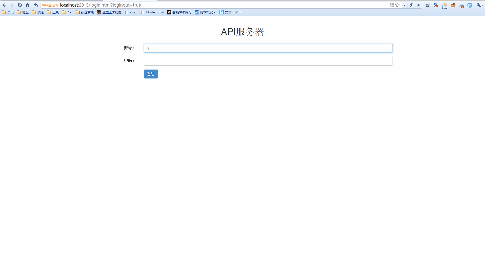

**感谢你的star成为我持续改进此项目的最好鼓励。**

# HTTP API 文档服务器

用来管理HTTP API文档和测试http请求的服务器。

## 安装

1. 请确认已经安装了[mongodb](https://www.mongodb.org/)。
2. [Node.js](https://nodejs.org)也需要提前安装。
3. 安装项目
```
$ git clone https://github.com/yalishizhude/api-server.git
```
4. 安装bower
```
$ npm install bower -g
```
5. 安装依赖
```
$ npm install
$ bower install
```

## 特点
* 基于MEAN(Mongodb,Express,Angular,Node)技术实现。
* 支持在线编辑和查看文档。
* 支持简单的权限管理。
* 提供了一个mock服务器用来响应前端浏览器请求，不需要后端服务器和数据库（需要安装[api-mock](https://github.com/yalishizhude/api-mock)）。
* 发送请求给后端并可根据后端返回结果更新接口开发状态。
* 提供JSON schema校验规则来检查请求/返回参数。

## 快速开始

1. 启动mongodb
2. 安装依赖模块

```
$ npm install
```

3. 启动服务器

```
$ npm start
```

## 注意事项

* 如果你修改了mongodb的默认连接，请在 **routes/config.js**中进行重新配置。
* 所有的 **删除** 操作都是 **双击左键**.

## 文档

mockjs (http://mockjs.com/)

mongodb (https://www.mongodb.org/)

express (http://expressjs.com/)

angular (http://docs.angularjs.cn/guide)

node (https://nodejs.org)

## 证书

  [MIT](LICENSE)
